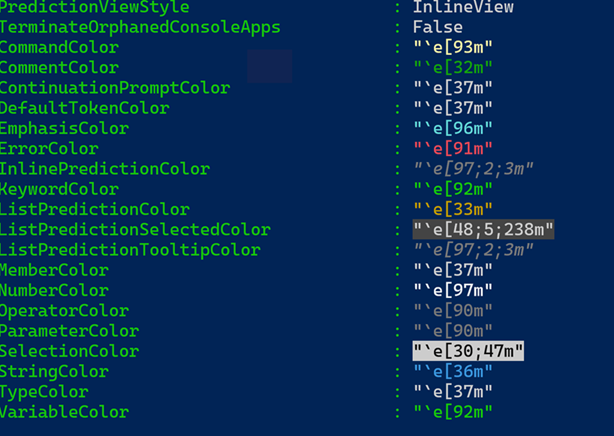
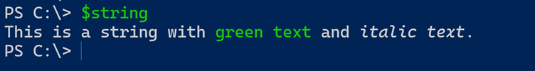
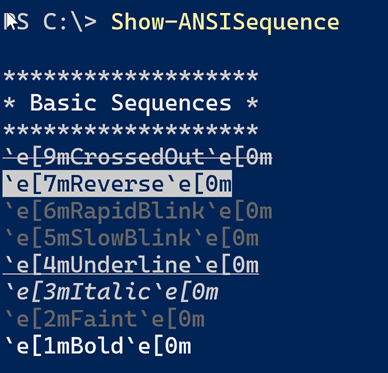
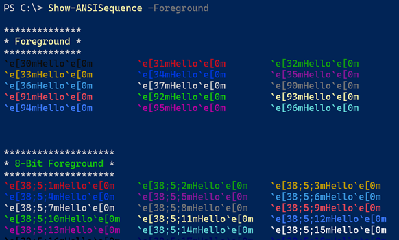
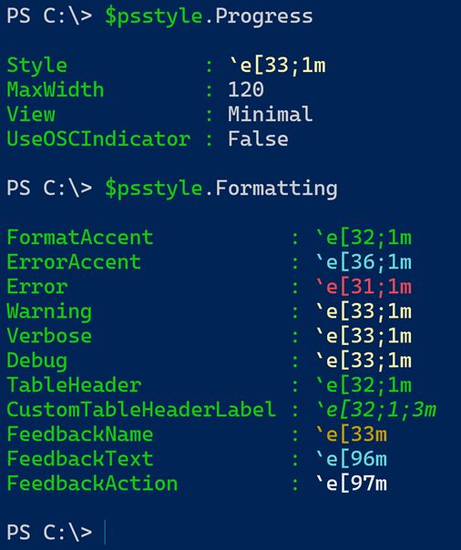
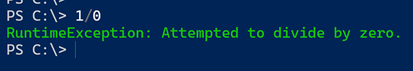
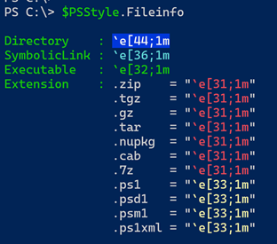
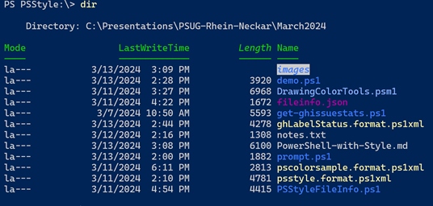
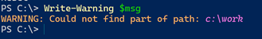
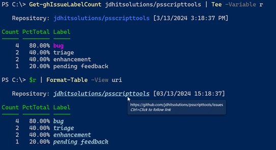

# PowerShell with Style


This is a presentation I gave to the PowerShell User Group Rhein Neckar in March 2024. You can view the presentation at [https://www.youtube.com/watch?v=6LySy7rrUO8](https://www.youtube.com/watch?v=6LySy7rrUO8)

The [`demo.ps1`](demo/demo.ps1) file is the master demo script meant to be run in VSCode. Or you can copy and paste commands into your PowerShell 7 session. **This will not work in the PowerShell ISE**.

## Abstract

*Many people think of PowerShell as a scripting language and forget that it is also a shell. But this is not the shell from DOS, or even from Windows 10. The new, modern PowerShell console is a rich, and colorful environment.*

*One recent PowerShell 7 feature that makes this possible is PSStyle. We've been able to use ANSI escape sequences in PowerShell for a while. But if you thought regular expressions were cryptic, ANSI sequences aren't much better. Fortunately, Microsoft has brought us PSStyle.*

## ANSI Integration

PowerShell has long supported ANSI escape sequences. However, the hosting application needs to support ANSI. The PowerShell ISE does not. An easy way to test is byt using `Get-PSReadLineOption`.

```powershell
Get-PSReadLineOption
```
You see color options formatted as ANSI escape sequences. This is an easy way to verify your host supports ANSI and PSStyle.



You can build strings with any ANSI escape sequence and use them in your scripts.

```powershell
$esc = "$([char]27)"
$Green = "$esc[92m"
$italic = "$esc[3m"
$off  =  "$esc[0m"

$string = "This is a string with $($green)green text$($off) and $($italic)italic text$($off)."
$string
```



> Don't forget to reset at the end of the string. You can always run `Get-PSReadLineOption` which will reset things for you.

You can use `Show-ANSISequence` from my [PSScriptTools](https://github.com/jdhitsolutions/PSScriptTools) module to view the escape sequences.

```powershell
Show-ANSISequence
Show-ANSISequence -Foreground -Background
```





PSStyle simplifies this process and provides a more consistent and predictable experience.

## PSStyle

PSStyle is an integrated feature into PowerShell 7 that works cross-platform. On Windows PowerShell, you can install the [PSStyle](https://github.com/sdwheeler/ToolModules/tree/main/Modules/PSStyle) module written by Sean Wheeler that provides comparable functionality. **It is not a back port for Windows PowerShell**

```powershell
$psstyle | Get-Member -MemberType Properties
```

> PSStyle renderings can be affected by console profile settings or color themes. different themes may render `red` differently.

```powershell

## Private Data Replacements

In Windows PowerShell, we could customize `$host.privatedata`.

```powershell
$host.PrivateData

FormatAccentColor       : Green
ErrorAccentColor        : Cyan
ErrorForegroundColor    : Yellow
ErrorBackgroundColor    : Black
WarningForegroundColor  : Yellow
WarningBackgroundColor  : Black
DebugForegroundColor    : Yellow
DebugBackgroundColor    : Black
VerboseForegroundColor  : Yellow
VerboseBackgroundColor  : Black
ProgressForegroundColor : Black
ProgressBackgroundColor : Yellow
```

This has been replaced with `PSStyle` in PowerShell 7.



```powershell
$PSStyle.Formatting.Error= $PSStyle.Foreground.BrightGreen
```



## FileSystem

PSStyle has been integrated into how the file system is displayed.



You can change colors and styles as needed. I might want to change how directories are displayed.

```powershell
$PSStyle.FileInfo.Directory = $PSStyle.Foreground.BrightBlue+$PSStyle.Italic+$PSStyle.Background.White
```

Change a file extension. You can use a native ANSI sequence or a PSStyle property.

```powershell
$PSStyle.FileInfo.Extension[".psm1"]="`e[38;5;111m"
$PSStyle.FileInfo.Extension[".ps1"]=$PSStyle.Foreground.BrightBlue
$PSStyle.FileInfo.Extension[".json"]=$PSStyle.Foreground.BrightMagenta
````



These changes are not persistent. Use your PowerShell profile script to set them.

## Scripting

You might want to integrate PSStyle into your script work. For example, you might want for format a message.

```powershell
$info = "`nRunning $($PSStyle.Background.Blue)PowerShell$($PSStyle.Reset) $($PSStyle.Foreground.Yellow)v{0}$($PSStyle.Reset) on $($PSStyle.Foreground.BrightCyan){1}$($PSStyle.Reset)." -f $($PSVersionTable.PSVersion),(Get-CimInstance win32_OperatingSystem).caption

Write-host $info
```

Here's an example that customizes a warning message.

```powershell
$PSStyle.Formatting.Warning = "`e[38;5;215m"
$msg = "Could not find part of path: {0}{1}{2}{3}" -f $PSStyle.Italic,$PSStyle.Foreground.FromRgb(228,112,214),"c:\work",$PSStyle.Reset
Write-Warning $msg
```



I use PSStyle in my custom format files to add information.

```xml
<GroupBy>
  <ScriptBlock>
  $link = $PSStyle.FormatHyperlink($_.Repository,"https://github.com/$($_.Repository)/issues")
  "$($PSStyle.Foreground.FromRGB(176,224,230) +$PSStyle.Italic)$link$($PSStyle.Reset) [$($_.ReportDate)]"
  </ScriptBlock>
  <Label>Repository</Label>
</GroupBy>
```


The `uri` custom view uses PSStyle into insert formatted hyperlinks.

## Thank You

I have enabled Discussions in this repository for questions and comments.

You can find more about me at [https://jdhitsolutions.github.io](https://jdhitsolutions.github.io) including links to my blog, premium newsletter, books, and social media profiles.
